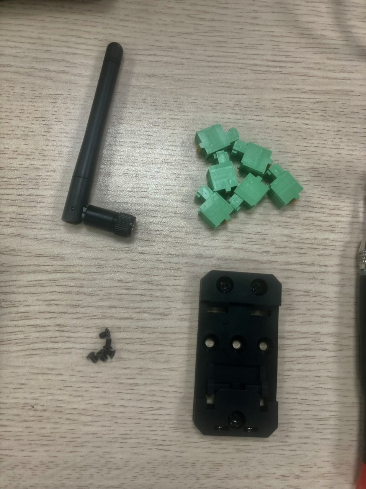
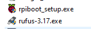
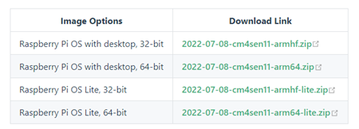
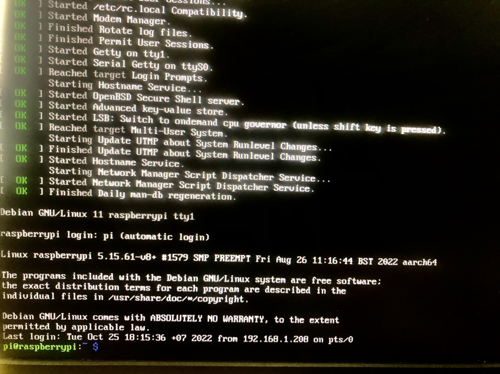
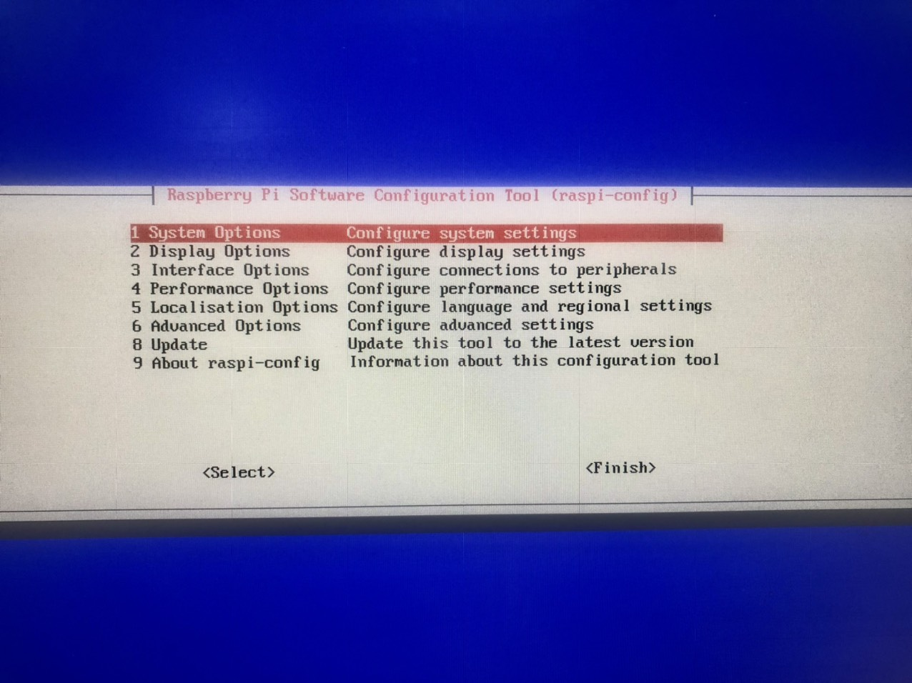
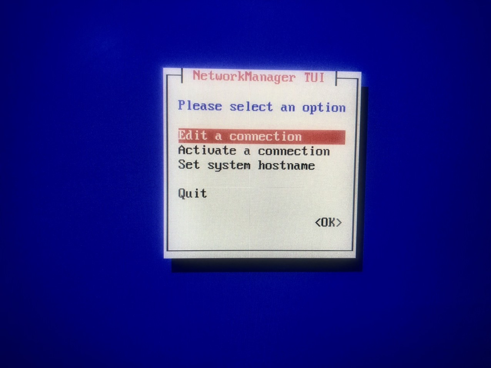
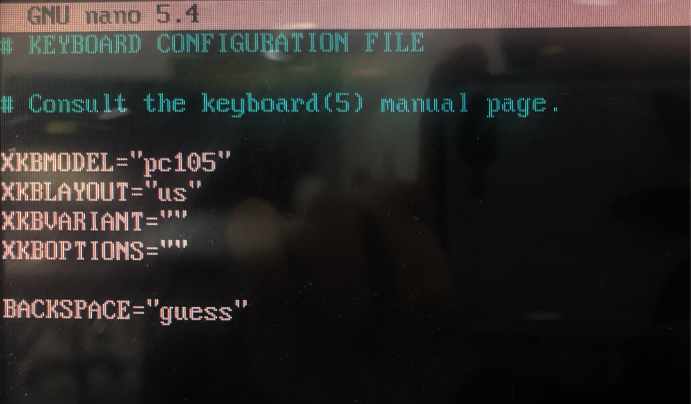

## Các bước setup cm4 sensing trên RasPi

#### Bước 1: Chuẩn bị phần cứng


- Tháo vỏ của Pi (rút các dây cắm, anten, terminal __>>__ tháo đế __>>__ tháo vỏ).



- Dùng 1 dây USB to MicroUSB, kết nối máy tính dùng Window với cổng J10 của Pi.

#### Bước 2: Chuẩn bị phần mềm

- Cài 2 phần mềm:

​    [Rpiboot](https://github.com/raspberrypi/usbboot/raw/master/win32/rpiboot_setup.exe)

​    [Rufus (3.17)](https://taimienphi.vn/download-rufus-10173/-317-phien-ban)



- Cài đặt theo hướng dẫn. Tải bản img của [OS Debian 11](https://docs.edatec.cn/cm4sen/downloads.html#raspberry-pi-os-image-with-bsp-installed) theo mong muốn.



#### Bước 3: Cài đặt

- Cấp nguồn cho Pi __>>__ chạy phần mềm rpiboot trong ```C:\Program File (x86)\Raspberry Pi\rpiboot.exe``` để cài driver và boot tool. Lúc này, Pi sẽ được coi như một ổ cứng ngoài của máy tính.

 

- Giải nén file zip chứa img __>>__ chạy phần mềm Rufus để load img vào Pi.


- Rút dây USB __>>__ lắp lại vỏ Pi như cũ __>>__ kết nối Pi với màn hình và bàn phím __>>__ khởi động lại cho Pi.

#### Bước 4: Thiết lập Pi



- Gõ lệnh trên màn hình Grub để vào giao diện config manager

``` sh
$ sudo raspi-config
```



- Chọn
  - 3 Interface Options > I2 SSH > Enable
  - 1 System Options > S1 Wireless LAN > VN > (SSID) > (PW)
  - Finish
- Trở lại màn hình Grub, gõ lệnh để vào giao diện wifi manager

``` sh
$ sudo nmtui
```



- Chọn
  - Activate a connection > (chọn tên wifi) > (gõ pw - rostek2019)
  - Ok
  
- Gõ '''ifconfig''' để xem đã kết nối mạng hay chưa. Nếu kết nối thành công, ip sẽ hiện ra (với ethernet hiện dưới eth0, wifi hiện dưới wlan0)

- Nếu muốn sửa đổi bộ gõ (hiện nay gõ Shift+2 sẽ thành " thay vì @), gõ lệnh trên màn hình Grub để vào giao diện config keyboard

``` sh
$ sudo nano /etc/default/keyboard
```



-
  - Sửa giá trị của XKBLAYOUT thành "us"
  - Nhấn Ctrl+S để lưu
  - Nhấn Ctrl+X để thoát
  - Gõ lệnh ```sudo systemctl restart console-setup.service``` để cập nhật chỉnh sửa bàn phím

- Nếu cần đổi password cho pi (mặc định là raspberry), gõ:

``` sh
$ passwd
```

-
  - Gõ mật khẩu hiện tại
  - Gõ mật khẩu mới
  - Gõ lại mật khẩu mới

Setup cơ bản đã xong.
