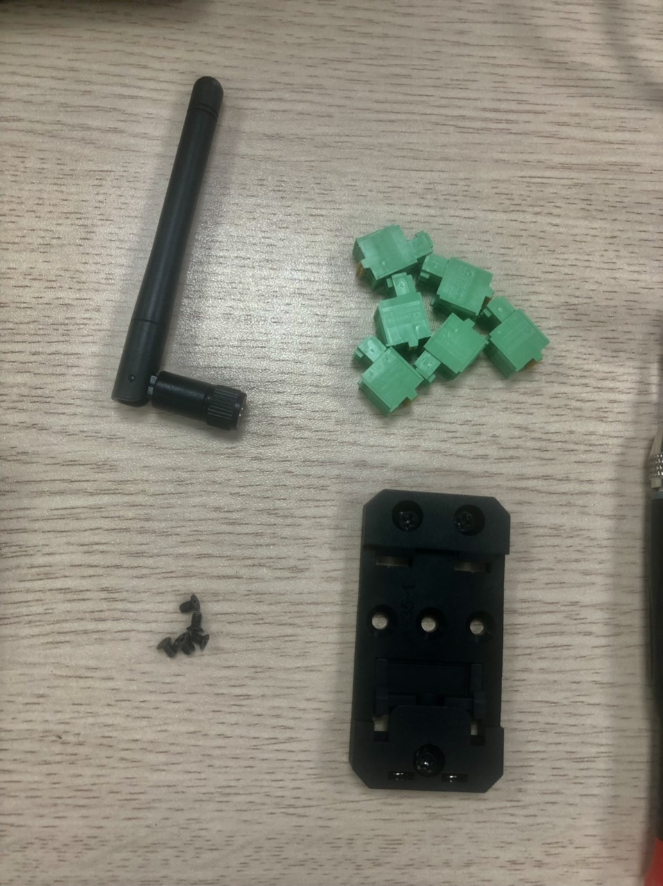
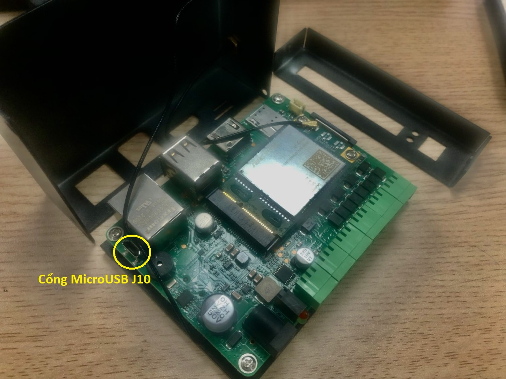
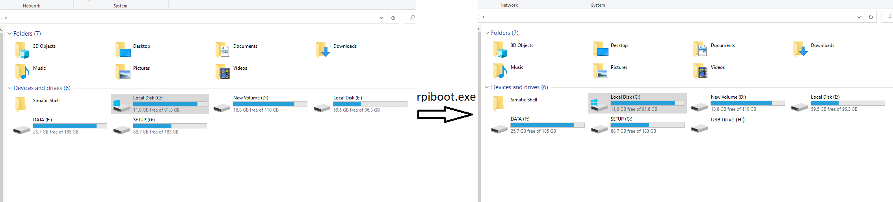
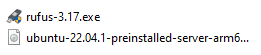
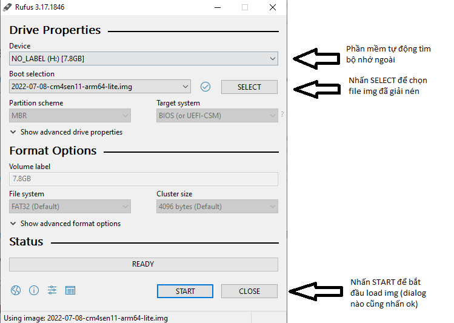
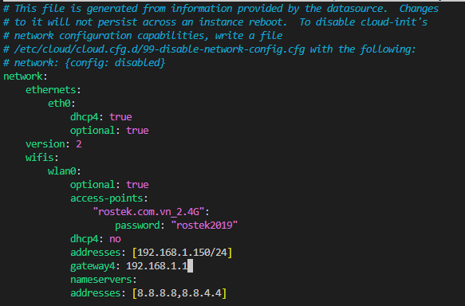
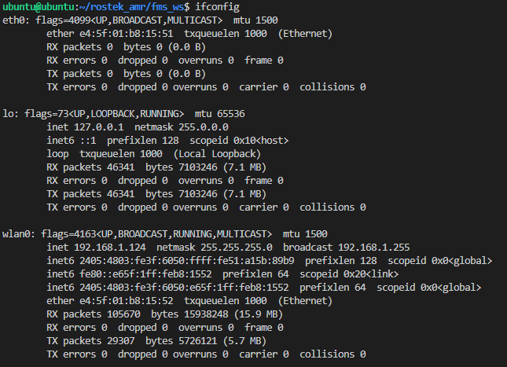

## Các bước setup hệ thống ACS (Amr Calling System) trên pi cm4-sensing

#### Bước 1: Kết nối với máy tính


- Tháo vỏ của Pi (rút các dây cắm, anten, terminal __>>__ tháo đế __>>__ tháo vỏ).



- Dùng 1 dây USB to MicroUSB, kết nối máy tính dùng Window với cổng J10 của Pi.

- Cài đặt phần mềm [Rpiboot](https://github.com/raspberrypi/usbboot/raw/master/win32/rpiboot_setup.exe), chạy file setup, nhấn next và finish.

- Cấp nguồn cho Pi __>>__ chạy phần mềm rpiboot trong ```C:\Program File (x86)\Raspberry Pi\rpiboot.exe``` để cài driver và boot tool. Lúc này, Pi sẽ được coi như một ổ cứng ngoài của máy tính.

 

#### Bước 2: Cài đặt hệ điều hành

- Download [Ubuntu 22.04 (Jammy Jellyfish)](https://releases.ubuntu.com/jammy/ubuntu-22.04.2-live-server-amd64.iso)

- Download [Rufus (3.17)](https://v51.x8top.net/tmp082020/cf/soft/2021/10/ba/4/rufus_317.exe)



- Giải nén file iso chứa ubuntu __>>__ chạy phần mềm Rufus để load img vào Pi.



- Rút dây USB __>>__ rút nguồn __>>__ lắp lại vỏ Pi như cũ __>>__ kết nối Pi với màn hình và bàn phím __>>__ cấp nguồn lại cho Pi.

- Nhập user và password đều là ```ubuntu```

#### Bước 3: Thiết lập mạng (khi không có kết nối ethernet, nếu có bỏ qua bước này)

- Khai báo mạng wifi trong file /etc/netplan/50-cloud-init.yaml.

``` sh
$ sudo nano /etc/netplan/50-cloud-init.yaml
```


- Thêm các dòng sau, chú ý không sử dụng tab mà phải sử dụng space để cách đầu dòng cho mỗi dòng.

``` yaml
    wifis:
        wlan0:
            optional: true
            access-points:
                "<your_wifi>":
                    password: "pass"
            dhcp4: true
```

- Các dòng trên để pi kết nối vào wifi tên ```your_wifi```, mật khẩu ```pass```, sẽ tự động tạo ra IP động. Để tạo IP tĩnh, thay dòng ```dhcp4: true``` bằng các dòng sau.

``` yaml
            dhcp4: no
            addresses: [<your_ip>/24]
            gateway4: <your_gateway_ip>
            nameservers:
                addresses: [8.8.8.8,8.8.4.4]
```



- Gõ lệnh để chạy phần sửa đổi, không xuất hiện lỗi là đã thiết lập mạng thành công (có thể xuất hiện warning).

``` sh
$ sudo netplan generate
$ sudo netplan apply
```

- Cài đặt net-tools để lấy trạng thái mạng nhanh chóng.

``` sh
$ sudo apt install net-tools
```

- Gõ ```ifconfig``` để xem đã kết nối mạng hay chưa. Nếu kết nối thành công, ip sẽ hiện ra (với ethernet hiện dưới eth0, wifi hiện dưới wlan0).



#### Bước 4: Thiết lập RS485

- Cài đặt 2 Board Support Package (BSP) cho pi để có thể kết nối các cổng RS485, RS232, CAN.

``` sh
$ curl -sS https://apt.edatec.cn/pubkey.gpg | sudo apt-key add -
$ echo "deb https://apt.edatec.cn/raspbian stable main" | sudo tee /etc/apt/sources.list.d/edatec.list
$ sudo apt update
$ sudo apt install ed-cm4sen-rev1p0-bsp ed-rtc
```

- Khởi động lại cho pi để áp dụng với lệnh ```sudo reboot```.

#### Bước 5: Cài đặt ROS2 và các thư viện cần thiết

- Cài đặt Ros2 Humble Hawksbill theo [hướng dẫn](https://docs.ros.org/en/humble/Installation/Ubuntu-Install-Debians.html].

``` sh
$ sudo apt install software-properties-common
$ sudo add-apt-repository universe
$ sudo curl -sSL https://raw.githubusercontent.com/ros/rosdistro/master/ros.key -o /usr/share/keyrings/ros-archive-keyring.gpg
$ echo "deb [arch=$(dpkg --print-architecture) signed-by=/usr/share/keyrings/ros-archive-keyring.gpg] http://packages.ros.org/ros2/ubuntu $(. /etc/os-release && echo $UBUNTU_CODENAME) main" | sudo tee /etc/apt/sources.list.d/ros2.list > /dev/null
$ sudo apt update
$ sudo apt upgrade
$ sudo apt install ros-humble-ros-base
$ echo "source /opt/ros/humble/setup.bash" >> ~/.bashrc
```

- Cài đặt compiler cho c++.

``` sh
$ sudo apt-get install build-essential
```

- Cài đặt colcon build tool.

``` sh
$ sudo apt install python3-colcon-common-extensions
```

- Cài đặt python lib.

``` sh
$ sudo apt install python3-pip
$ pip install pymodbus
```

#### Bước 6: Cài đặt hệ thống ACS

- Tạo workspace fms_ws với đường dẫn rostek_amr.

``` sh
$ cd ~
$ mkdir -p rostek_amr/fms_ws
```

- Download thư mục [src]() vào thư mục fms_ws, gõ lệnh build workspace và source vào workspace.

``` sh
$ colcon build --symlink-install
$ echo 'fmsws="source ~/rostek_amr/fms_ws/install/setup.bash"' >> ~/.bash_aliases
```

#### Bước 7: Chạy các package

- Lần lượt chạy các package.

``` sh
$ fmsws
$ ros2 run local_caller local_caller
$ ros2 run robot_controller controller
$ ros2 run ros_manager manager
```
